During the course of Basics of Game Programming I managed to grasp a lot of different concepts of Game Programming and Development. Here's a brief list of what I used and learned:

-	Creating menus and panels with animations
-	Animating characters with ready-made animations from Adobe Mixamo. Edit-ing animations with UMotion (from Unity Asset Store)
-	Using animation events with animations
-	Using ready-made prefabs and using them via scripts
-	Using ready-made sounds and music, and managing them via scripts
-	Using different Unity Packages such as Cinemachine, Input System, Mecanim, Particle Pack
-	Using Navigation mesh and Navigation mesh agents
-	Different functionalities such as:
    - player movement and jump
    - item pickup and inventory system
    - Creating and managing a GUI (item hotbar, health)
    - most of gun functionalities
    - using items and weapons
    - Zombie AI
    - Health, damage and death
    - Enemy Spawner with states

## Images with captions

### Hotbar

I coded a hotbar system that can take consumable items and weapons such as bullets and stores them on separate inventories. Bullets will be visualized on different slots than weapons. Active weapons will show their current magazine bullet count.

### Main Menu

I animated a main menu with characters. Character animatios are from Adobe Mixamo. The campfire light is also animated.

### Game intro

I created an intro animation with animated text on a black screen.

###

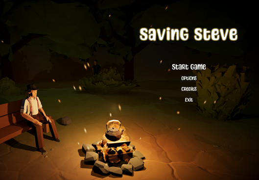
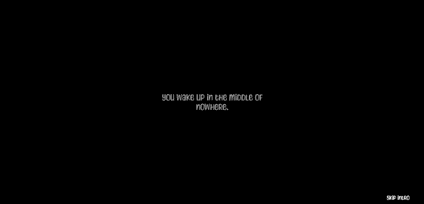
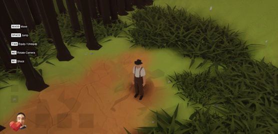
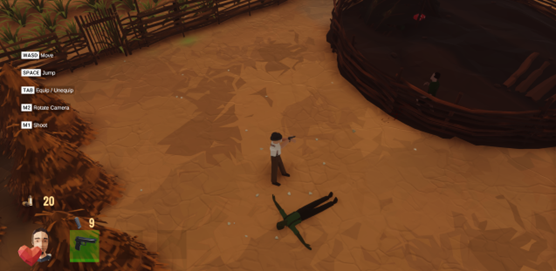
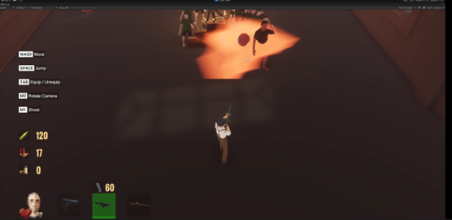
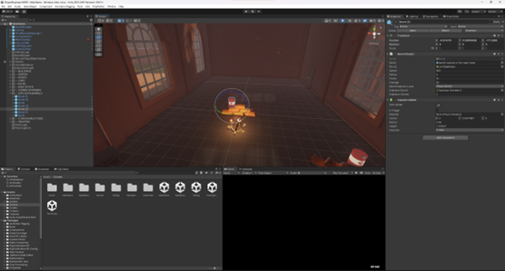
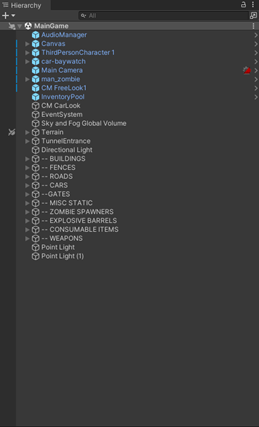
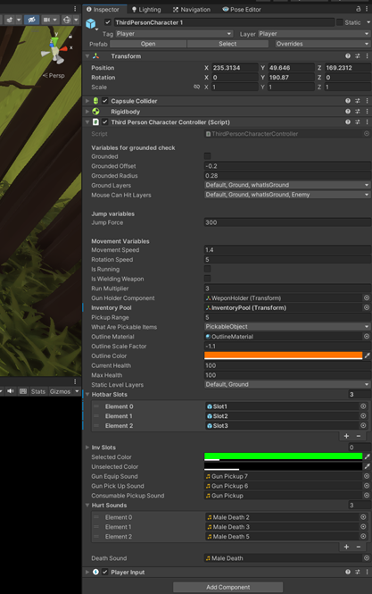
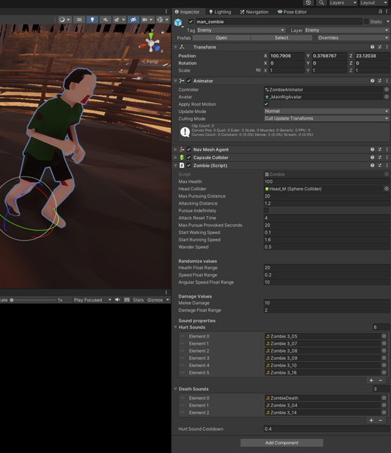
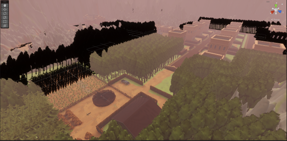
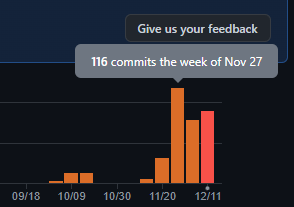