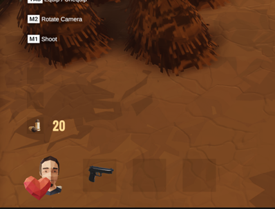

During the course of Basics of Game Programming I managed to grasp a lot of different concepts of Game Programming and Development. Here's a brief list of what I used and learned:

-	Creating menus and panels with animations
-	Animating characters with ready-made animations from Adobe Mixamo. Edit-ing animations with UMotion (from Unity Asset Store)
-	Using animation events with animations
-	Using ready-made prefabs and using them via scripts
-	Using ready-made sounds and music, and managing them via scripts
-	Using different Unity Packages such as Cinemachine, Input System, Mecanim, Particle Pack
-	Using Navigation mesh and Navigation mesh agents
-	Different functionalities such as:
    - player movement and jump
    - item pickup and inventory system
    - Creating and managing a GUI (item hotbar, health)
    - most of gun functionalities
    - using items and weapons
    - Zombie AI
    - Health, damage and death
    - Enemy Spawner with states

## Images with captions

### Hotbar

I coded a hotbar system that can take consumable items and weapons such as bullets and stores them on separate 

